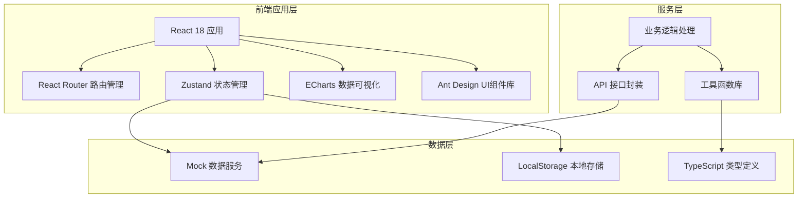
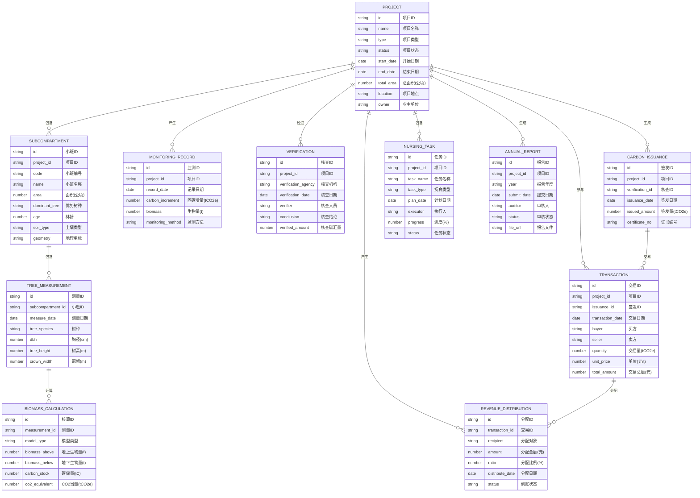

## 1. 架构设计



## 2. 技术栈说明

- **前端框架**：React 18 + TypeScript 5
- **构建工具**：Vite 5
- **UI 组件库**：Ant Design 5
- **路由管理**：React Router v6
- **状态管理**：Zustand 4
- **数据可视化**：ECharts 5
- **图标库**：Lucide React
- **样式方案**：TailwindCSS 3
- **日期处理**：Day.js
- **HTTP 请求**：Axios
- **地图组件**：Leaflet（开源地图）
- **后端**：无（纯前端Mock数据）
- **数据存储**：LocalStorage + Mock数据

## 3. 路由定义

| 路由路径 | 页面名称 | 说明 |
|----------|----------|------|
| / | 首页概览 | 项目统计数据、关键指标看板 |
| /project | 项目台账 | 碳汇项目档案、项目年度报告 |
| /forest | 林地资源 | 林地小班区划、林权权属 |
| /monitoring | 碳汇监测 | 树种胸径测量、固碳增量监测 |
| /accounting | 计量核算 | 生物量碳储量核算、碳汇计量模型 |
| /trading | 交易管理 | 第三方核查、碳汇签发登记、碳排放权交易 |
| /management | 营林管护 | 营林抚育管护、抚育作业记录 |
| /revenue | 收益分配 | 收益分配台账、收益统计分析 |

## 4. 数据模型

### 4.1 实体关系图



### 4.2 数据初始化

系统采用Mock数据，包含：
- 5个碳汇项目示例数据
- 每个项目包含10-20个林地小班数据
- 3年的监测记录和测量数据
- 完整的核算、核查、签发、交易和分配流程数据
- 营林管护任务和年度报告数据

## 5. 目录结构

```
src/
├── assets/              # 静态资源
│   ├── images/          # 图片资源
│   └── styles/          # 全局样式
├── components/          # 公共组件
│   ├── layout/          # 布局组件
│   ├── charts/          # 图表组件
│   ├── table/           # 表格组件
│   └── common/          # 通用组件
├── pages/               # 页面组件
│   ├── dashboard/       # 首页概览
│   ├── project/         # 项目台账
│   ├── forest/          # 林地资源
│   ├── monitoring/      # 碳汇监测
│   ├── accounting/      # 计量核算
│   ├── trading/         # 交易管理
│   ├── management/      # 营林管护
│   └── revenue/         # 收益分配
├── store/               # 状态管理
├── services/            # API服务
├── mock/                # Mock数据
├── types/               # TypeScript类型定义
├── utils/               # 工具函数
├── App.tsx
├── main.tsx
└── router.tsx           # 路由配置
```

## 6. 性能优化

- 代码分割：按路由进行懒加载
- 虚拟滚动：大数据量表格使用虚拟滚动
- 图表懒加载：滚动到可视区域再渲染图表
- 状态优化：使用Zustand避免不必要的重渲染
- 防抖节流：搜索、滚动等高频操作优化
- 缓存策略：静态资源哈希命名，Mock数据本地缓存
